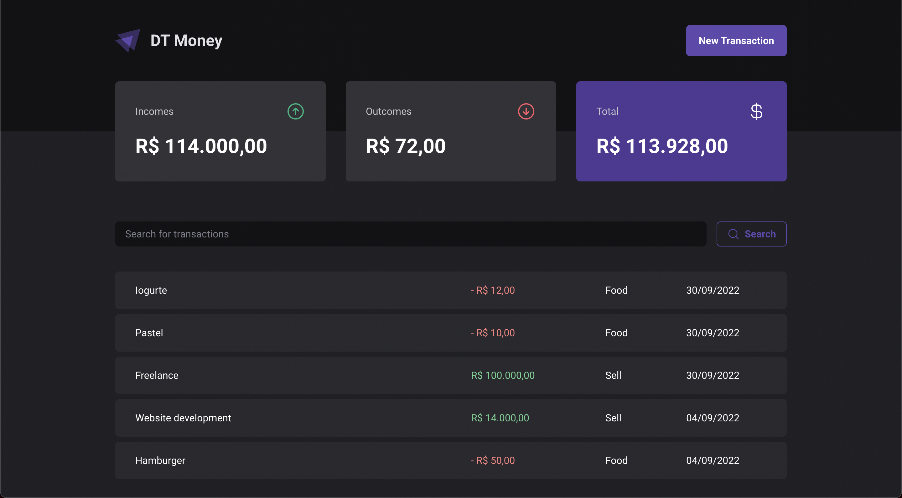

<p align="center" t>
  
</p>

DT Money is your favorite online wallet made with React, Vite and Chakra UI ⚛️


# Proposal 🔥

<p align="center" t>
  
</p>

Live demo: https://coffeelivery-prqt7d4xf-andrecampll.vercel.app

# Outcomes 🚀

- This project was made to approach and practice advanced React concepts like reducers and Context API to handle the global state management.

- Chakra UI that builds up the entire application styles.

- Used React performance functions (useCallback, useMemo, memo) to increase performance by preventing components from re-rendering unnecessarily.

- Used `use-context-selector` to increase application performance by selecting the specific pieces of state when using hooks.

- There's an advanced React Hook that handles the integration with the Nominatim API in order to do the geolocalization feature.

- An awesome integration with React Hook Form that handles the forms state management.

# Technologies 🚀
React ⚛️ <br />
React Hook Form ⚛️ <br />
Vite ⚡️ <br />
Chakra UI 💅 <br />
Typescript 🦕 <br />

# Getting Started 🤔
```bash
# Fork this repository

# Clone your fork
$ git clone your-fork-url && cd dt-money

# Run the `dev:server` command to build up the fake server
$ yarn dev:server

# Start the project by running `dev` command
$ yarn dev

# Open your browser on `localhost:5173`
```

# How to contribute? 😍
```bash
# Fork this repository

# Clone your fork
$ git clone your-fork-url && cd dt-money

# Create a branch with your feature or bug fix
$ git checkout -b my-branch

# Commit your changes
$ git commit -m 'my changes'

# Push your branch
$ git push origin my-branch
```

Delete your branch, if you want, when your pull request merge. <br />

Made with 💜 by <a href="https://www.linkedin.com/in/andrecampll/" target="_blank"> andrecampll </a>. <br />
<br />
